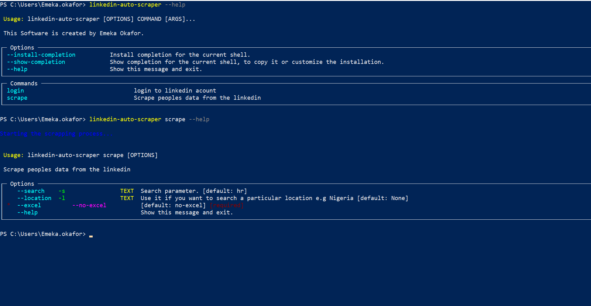

# LinkedIn Auto Scraper

LinkedIn Auto Scraper is a command-line application designed to scrape cleaned information from LinkedIn profiles based on job titles and locations. The app offers two main commands: `login` and `scrape`. Once you've logged in using the `login` command, you can perform continuous scraping without the need to log in again, thanks to the authentication caching feature.

## Table of Contents

-   [Installation](https://chat.openai.com/c/b42c6a84-5afc-4a4e-a9ae-23be4b649973#installation)
-   [Usage](https://chat.openai.com/c/b42c6a84-5afc-4a4e-a9ae-23be4b649973#usage)
    -   [Login](https://chat.openai.com/c/b42c6a84-5afc-4a4e-a9ae-23be4b649973#login)
    -   [Scrape](https://chat.openai.com/c/b42c6a84-5afc-4a4e-a9ae-23be4b649973#scrape)
-   [Contributing](https://chat.openai.com/c/b42c6a84-5afc-4a4e-a9ae-23be4b649973#contributing)
-   [License](https://chat.openai.com/c/b42c6a84-5afc-4a4e-a9ae-23be4b649973#license)

## Installation

1.  Ensure you have Python 3.x installed.

   	pip install linkedin-auto-scraper

or
    
2.  Clone this repository:

   git clone https://github.com/your-username/linkedin-auto-scraper.git
    
-   Navigate to the project directory: 
    
   `cd linkedin-auto-scraper` 
    
-   Install the required dependencies  

	 `pip install -r requirements.txt` 
    

## Usage

### Login

To use the app, you need to log in first. This step is required for authentication purposes. Run the following command:

bash

`linkedin-auto-scraper login` 

This command lets you log in to your LinkedIn account. Follow the prompts to provide your LinkedIn credentials. Your authentication will be cached to allow continuous scraping without repeated logins.

### Scrape

Once you're logged in, you can start scraping LinkedIn profiles based on job titles and locations. Run the following command:

bash

`linkedin-auto-scraper scrape` 

By default, the app will search for profiles related to the HR field. You can customize the search by using the following options:

-   `--search` (`-s`): Specify the search parameter (default: "hr").
-   `--location` (`-l`): Use it to search for profiles in a specific location (default: None).
-   `--excel`: This option is required and indicates whether to generate an Excel file with the scraped data (default: no-excel).

Example usage:

bash

`linkedin-auto-scraper scrape --search software engineer --location San Francisco --excel` 

Follow the prompts to enter the desired job title and location. The app will scrape and display cleaned information from LinkedIn profiles matching your criteria.

## Contributing

Contributions are welcome! If you'd like to contribute to the project, please follow these steps:

1.  Fork the repository.
2.  Create a new branch for your feature/bugfix: `git checkout -b feature-name`
3.  Commit your changes: `git commit -m "Description of changes"`
4.  Push to the branch: `git push origin feature-name`
5.  Create a pull request.

## License

This project is licensed under the [MIT License]
